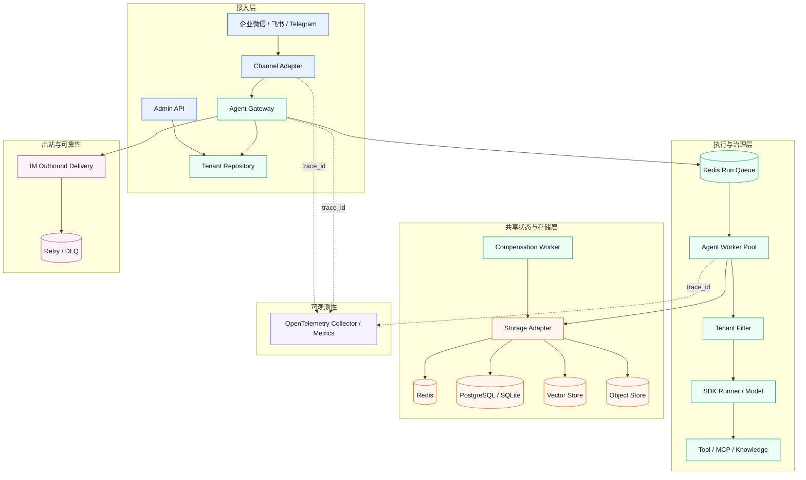

# 多租户 Agent 平台架构设计

## 系统架构图

## 组件协作

`Channel Adapter` 负责企业微信、飞书、Telegram 和 Web UI 的验签、解密、解析、媒体下载、用户映射和出站投递。企业微信集成优先用 `wechatpy`，Telegram 优先用 `python-telegram-bot`，飞书优先用 `lark-oapi`（官方 SDK），在 SDK 不可用时降级到 HTTP API。

`Agent Gateway` 接收 `InboundMessage`，按 `channel + account_id` 查询 `ChannelBinding` 得到 `tenant_id` 与 `agent_app_id`，生成 `session_id`、`idempotency_key` 和 `trace_id`，预留配额后写入 Redis 队列。`Agent Worker` 加载租户配置、Session、Memory 和 Summary，执行租户 Filter、tRPC-Agent-Python Runner、模型调用和 Tool/MCP/Knowledge 调用，并写回结果。

`Storage Adapter` 抽象 InMemory、Redis、SQL、向量库、对象存储和外部 Memory 服务的差异。`Admin API` 管理租户、Agent 应用、通道绑定、配置版本、发布、回滚和灰度发布。`Telemetry Collector` 通过 `trace_id` 串联从 IM 回调到 Gateway、Runner、模型、工具、存储直到 IM 回复的完整链路。

## 框架复用与平台扩展

**可复用的 tRPC-Agent-Python 能力**：Runner、Session、Memory、Summary、Knowledge、Tool/MCP、Filter、模型 Provider、Agent Event、FastAPI/Web 和 Telemetry。

**平台层新增模块**：`tenant/` 配置版本与灰度发布、`gateway/` 路由与队列管理、`channels/` IM 适配器、`storage/` 多后端支持与迁移、`policy/`/`security/` 治理与脱敏、`admin/` RBAC、`deployment/` 生产部署清单。框架层负责 Agent 语义，平台层负责租户边界、IM 协议、审计、成本和运维。

**运行时边界说明**：平台 `StorageBundle` 是 Session 事件/状态、Memory、Summary、Artifact、Knowledge、Audit 和幂等记录的唯一权威存储。tRPC-Agent-Python Runner 仍然复用 SDK 的 SessionService 接口，但运行时使用的是每次调用创建的临时 InMemory SessionService，且设置 `include_previous_history=False`；平台已从共享后端加载并脱敏历史会话后显式传入当前 Prompt。这样 Worker 仍可利用 SDK Runner、Tool 和模型编排能力，同时避免在 SDK Redis/SQL 中额外生成一份无法与平台事件对账的 Session 记录。租户的 Redis/SQL Secret Ref 只由 `Storage Adapter` 解析并连接，不再由 SDK 运行时自行读取进程级默认连接串。

## 租户模型与隔离

租户配置以不可变版本保存，发布和回滚操作只切换 active version 指针。最小模型包含 `tenant_id`、Agent 应用配置、模型配置、工具权限、IM 通道配置、存储后端配置、审计策略和配额策略。应用配置定义应用 ID、提示词和状态；模型配置保存 provider、model、base_url、timeout、cost 和 `api_key_ref`；工具策略保存白名单、黑名单、审批要求和用户权限；通道配置保存 webhook URL、token/secret 引用、账号 ID 和 Agent 绑定；后端配置决定 Session、Memory、Summary、Artifact、Knowledge 和 Audit Log 的存储位置。

**隔离规则**：所有存储接口强制传入 `tenant_id`；Redis Key 使用租户前缀；SQL 使用复合主键；向量库使用租户作用域的 collection；对象存储使用租户路径；工具执行前经过租户 Filter；日志、Trace、Audit 和错误统一脱敏 Authorization 头、Token、Secret、手机号和邮箱；配置只保存 `secret://tenant/name/key` 或 `env://NAME` 引用。

## 路由与水平扩展

外部回调不能覆盖租户分配。Gateway 仅信任平台侧 `ChannelBinding`：`channel + account_id -> tenant_id + agent_app_id`。单聊 `session_id` 通过哈希 `tenant_id + channel + account_id + user_id + agent_app_id` 生成；群聊使用 `group_id/conversation_id` 替代 user 维度，确保跨群、跨租户、跨账号的 session 完全隔离。

**无需 sticky session**：Gateway、Worker 和 Outbound Worker 不依赖进程内上下文。Session 事件/状态、Memory、Summary、幂等记录、配额、审计日志和队列均存储在共享后端。负载均衡器可将请求路由到任意 Gateway；Redis 队列可将任务分派给任意健康 Worker。InMemory 模式仅用于单进程演示。

## 数据一致性与多后端支持

Session 采用 append-only 事件 + 状态 CAS：Worker 先追加 user/assistant/tool 事件，再通过 `state_version` 乐观锁更新 `session_state.latest_event_seq`。Summary 写入携带 `source_event_seq` 防止旧摘要覆盖新消息。Memory 写入共享后端后，其他节点在下次读取时可见；向量索引或外部 Memory 服务可能存在刷新延迟，因此权威 SQL/Memory 服务存储原文，向量库作为检索索引。

**后端特性**：
- **Redis**：队列、幂等、锁、热 Session、配额计数器。低延迟但需管理 TTL、内存和高可用。
- **PostgreSQL**：配置、事件、Memory、Summary、Audit、补偿任务。事务强一致性但需规划连接池、索引和分区。
- **向量库**：Knowledge embedding，通常最终一致。
- **对象存储**：图片、文件、长文本 Artifact、迁移包。SQL 存储元数据。
- **外部 Memory 服务**：降低运维负担但增加网络延迟、限流和合规风险。

## 治理、监控与恢复

**租户 Filter**：执行工具白名单/黑名单、脱敏敏感数据、执行预算限制、危险工具需要审批、校验 IM 用户权限。

**监控指标**：请求量、模型延迟、工具执行时长、IM 投递成功率、错误率、token 消耗、租户成本、Session 后端延迟。

**审计字段**：`tenant_id`、`channel`、`user_id`、`session_id`、`agent_name`、`tool_name`、`decision`、`latency`、`error_type`、`cost`、`trace_id`。

**可靠性保障**：重复 IM 投递命中已完成的幂等记录时直接复用结果。Worker 崩溃依赖队列 visibility timeout 进行重放；模型超时和 429 使用退避、重试和熔断；工具失败写入审计和指标；Memory、Summary、Audit 派生写入失败时进入 `compensation_task`，由补偿 Worker 重放。灰度发布使用 `tenant_id + session_id` 的稳定哈希进行流量分流，支持 session 级覆盖；回滚仅切换租户 active version。

## 部署方案

**最小部署（Docker Compose）**：Gateway、2 个 Worker、补偿 Worker、出站 Worker、Redis、PostgreSQL，可选 OpenTelemetry Collector。

**生产部署（Kubernetes）**：Gateway 根据 HTTP 并发扩容，Worker 根据队列深度扩容，补偿 Worker 独立扩容；Redis/PostgreSQL 高可用；Knowledge 使用外部向量库；Artifact 使用对象存储；Ingress 配置 TLS；密钥从 ExternalSecret/Vault/KMS 获取。仓库的 `platform.yaml` 包含一个可替换 exporter 的 OTEL Collector Deployment/Service；应用通过 `http://otel-collector:4318` 上报。生产环境应将 debug exporter 替换为 OTLP、Jaeger、Tempo 或云厂商 exporter，并将外部 egress 的 `0.0.0.0/0` 收紧为实际 CIDR。

**网络策略**：生产网络策略应按 Gateway、Worker、补偿 Worker、出站 Worker、Collector、Redis 和 PostgreSQL 通过 Pod 选择器分段，显式限制共享存储的入站来源，允许 DNS、Collector 和必要的外部 HTTPS。如果 Redis、PostgreSQL、模型提供商、IM 平台、向量库或对象存储在集群外，必须将模板中宽泛的外部 CIDR 替换为企业批准的地址段。NetworkPolicy 只解决网络边界问题，不能替代 Secret Manager、数据库 ACL 和应用层租户鉴权。

## 请求生命周期与配置版本

管理面先创建租户配置草稿，再执行 Schema 校验、Secret Ref 检查、工具白名单检查和通道账号唯一性检查。保存配置时生成不可变版本，发布动作只修改租户的 active version 指针。Gateway 每次接收消息都重新解析通道绑定和运行时版本；Worker 请求携带 `tenant_id`、`agent_app_id`、`session_id`、`config_version`、`idempotency_key` 和 `trace_id`，因此执行期间不会依赖某个 Gateway 进程的隐式状态。灰度发布使用租户和 Session 的稳定哈希，同一个 Session 在灰度期间始终命中同一版本；发现错误率、模型延迟或成本异常后，回滚只切换 active version，不删除历史配置。

## Session、Memory 与派生数据

一条入站消息先以 append-only event 形式写入共享 Session，再执行模型和工具。助手事件、工具事件和状态更新必须带同一条链路的 trace_id。Session state 使用版本号 CAS，Summary 记录覆盖到的最大 event 序号，Memory、Summary 和 Audit 属于可补偿的派生数据。核心 event 写入失败时不返回成功，交给 IM 重试；派生写入失败时创建 compensation task，由补偿 Worker 按租户和操作类型重放。这样既不会因为摘要服务短暂故障丢失原始对话，也不会让旧摘要覆盖新消息。Memory 的权威原文放在 SQL、Redis 或外部 Memory 服务，向量库只承担带租户 metadata 的检索索引；索引刷新延迟不会影响原始事件保存。

## IM 协议边界

企业微信和飞书可能通过 XML/JSON、Token、签名或 AES 加密回调传递消息，Telegram 则使用 Bot Token、Webhook Secret、chat_id 和 message_id。Adapter 只负责协议和平台限制，Worker 只接触统一的 `InboundMessage`，避免平台字段进入 Agent 逻辑。回调入口快速完成验签、解密、绑定解析和幂等登记，耗时的 Agent 执行放入 Worker 队列。长文本按账号限制切片，媒体先进入 Artifact Store，回复失败进入指数退避和死信队列；不支持的文件类型必须返回明确失败，不能伪装成已送达。

## 容量、成本与安全边界

容量评估从 IM 峰值开始：`执行并发 = IM 峰值 × Agent 比例 × 平均执行秒数`，Worker 数量再除以单 Worker 稳定并发和目标利用率。Redis 需要按 Session 热 Key、幂等记录、队列、锁和配额计数估算操作数；SQL 需要按 event、state、Memory、Summary、Audit 和补偿任务估算写入量；模型成本按租户累计输入和输出 Token 计量。所有配额、指标、审计和告警都带租户维度，但不把完整 Prompt、模型 Key、IM Token、数据库密码或带凭据 DSN 写入日志和 Trace。Secret Ref 只在运行时解析，生产使用 KMS、Vault 或 External Secrets，并通过密钥轮换和最小权限降低泄露影响。

## 生产落地检查

Compose 用于复现完整链路和故障注入，生产使用 Kubernetes 时还必须完成镜像扫描、镜像签名、ExternalSecret、TLS、数据库备份恢复演练、Redis 高可用、向量库和对象存储权限、Collector exporter、Prometheus 告警以及真实 IM 公网回调配置。仓库清单提供组件拓扑、探针、资源限制、PDB、HPA 和 NetworkPolicy，但外部依赖的地址、证书、SecretStore、数据库 ACL 和企业网络规则必须由部署环境替换。代码层面的 mock 和 Web UI 验证不能替代真实企业微信或 Telegram 账号验收。
