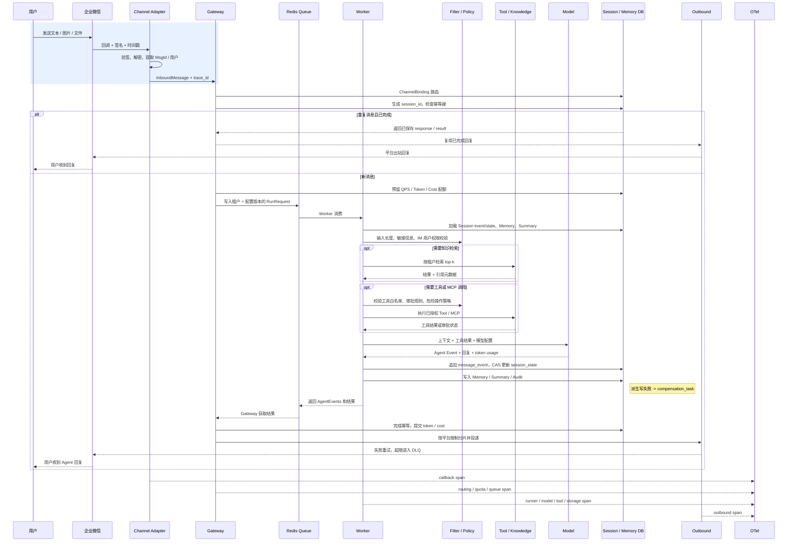

# 核心链路时序图

本文档展示“企业微信用户发消息 -> Agent 执行 -> Tool 调用 -> Session / Memory 写入 -> IM 回复”的完整链路。飞书和 Telegram 也遵循同一标准入站消息和出站消息模型，只是在 Channel Adapter 层处理各自的平台协议。

## Trace 串联

每条入站消息在 Channel Adapter 处生成或继承 `trace_id`。该 ID 会写入 `InboundMessage`、`TenantContext`、`RunRequest`、模型调用 Span、工具调用 Span、存储 Span、审计日志和出站投递 Span。这样可以在故障排查时从一次 IM callback 反查到租户绑定、配额决策、模型耗时、工具审批、Session 写入、IM 投递结果和错误类型。

关键 Span 建议如下：

| Span | 关键属性 |
| --- | --- |
| `im.callback` | `tenant_id`、`channel`、`account_id`、`external_message_id`、验签结果。 |
| `gateway.route` | `tenant_id`、`agent_app_id`、`session_id`、配置版本、幂等状态。 |
| `gateway.quota` | QPS、预留 token、预留成本、拒绝原因。 |
| `worker.run` | Worker ID、队列等待时间、执行耗时、结果状态。 |
| `model.call` | 模型供应商、模型名、耗时、token usage、重试次数、错误类型。 |
| `tool.call` | 工具名、审批结果、耗时、错误类型，参数只记录脱敏摘要。 |
| `storage.write` | 后端类型、表/Key 类型、CAS 版本、延迟、冲突次数。 |
| `im.outbound` | 平台、消息类型、分片数量、重试次数、投递结果。 |

## IM 消息转换规则

入站方向由各平台 Adapter 转换为统一 `InboundMessage`，字段包括 `channel`、`account_id`、`external_message_id`、`conversation_type`、`conversation_id`、`user_id`、`content_type`、`text`、`attachments`、`raw_headers` 和 `received_at`。平台 XML、JSON、签名字段和加密字段不会向 Worker 泄漏，Worker 只处理标准化后的消息。

出站方向由 Worker 产生 `AgentEvent`，Gateway 按平台能力转换为文本、卡片、图片、文件或异步消息。超过平台长度限制的文本会被切分；频率限制触发时进入延迟重试；文件和图片使用 Artifact 后端生成可访问 URL；撤回或投递失败会写入审计和死信队列。
